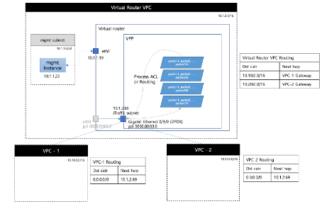
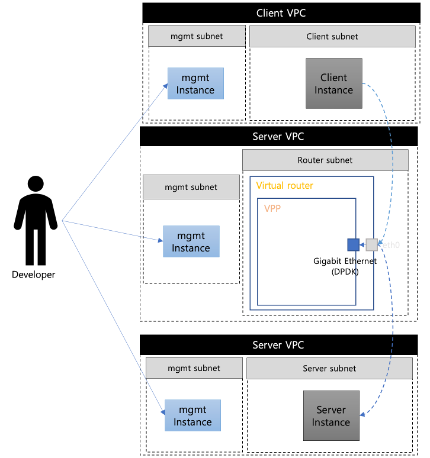
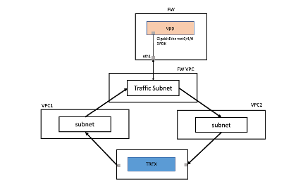

# VPP router 성능측정
### Khu 졸업 프로젝트

 

## 목적

 

Virtual Packet Processing(VPP)과 Data Plane Developement Kit (DPDK)를 이용한 가상화된 네트워크 기술의 성능 개선은 기존 리눅스 가상화된 네트워크 환경에서 발생하는 커널 호출과 멀티코어 문제, 우선순위 문제로 인한 성능 저하 문제를 해결하기 위해 VPP와 DPDK를 이용하여 가상화된 라우터와 방화벽의 성능을 개선하는 것을 목표로 한다.
논문에서는 VPP와 DPDK를 이용한 가상화된 라우터와 방화벽을 구축하고 성능 개선에 대한 실험을 진행할 것이다. 이를 위해 Trex 네트워크 트래픽 생성기를 이용하여 성능 측정을 한다.
결과로 VPP와 DPDK를 이용한 가상화된 네트워크 기술이 기존의 가상화된 네트워크 환경보다 더 나은 성능과 높은 처리량을 보장하는 가상화 네트워크를 구현한다.

 

## 기존 Linux router의 문제

 

기존 리눅스 라우터는 리눅스 커널의 고질적인 문제로 인해 여러 가지 문제점을 가지고 있다. 이러한 문제점을 구조적으로 살펴보면 다음과 같다.

첫째, 커널 공간(Kernel Space)과 사용자 공간(User Space) 간의 구분이 불명확하다. 리눅스 커널은 하나의 단일 공간으로 되어 있으며, 커널 모듈과 사용자 프로세스가 함께 동작한다. 이로 인해, 사용자 공간에서 발생한 오류가 커널 공간에 영향을 미치는 경우가 발생할 수 있다.

둘째, 패킷 처리 속도가 느리다. 리눅스 커널은 일반적인 서버용 운영 체제로 개발되어, 네트워크 처리에는 초점이 맞춰지지 않았다. 따라서, 라우팅 테이블 검색, ACL(Access Control List) 적용, 패킷 처리 등의 기능에 있어서는 성능이 떨어질 수밖에 없다.

셋째, 스케일링이 어렵다. 리눅스 커널은 다양한 하드웨어와 사용자 환경에 대한 호환성을 고려하여 설계되었기 때문에, 하나의 시스템에서 많은 수의 가상화 인스턴스를 실행할 경우에는 처리량이 떨어진다.

이러한 문제점을 해결하기 위해 VPP(Virtual Packet Processor)와 DPDK(Data Plane Development Kit)를 이용한 가상화 네트워크 장비를 구현한다. VPP와 DPDK는 하드웨어 가속 기능을 이용하여 높은 패킷 처리 속도를 제공하며, 스케일링이 용이하도록 설계되어 있다. 이러한 기술들은 기존 리눅스 라우터의 문제점을 해결하고, 더 나은 가상화 네트워크 환경을 제공할 수 있다.

 

## 라우터 구성
 

 *리눅스 가상라우터*

> 각각의 VPC에서 VM의 Linux 라우팅을 이용하여 라우팅을 하는 라우터를 구축한다. 각각의 subnet은 모든 트래픽을 Virtual router를 통해 주고 받는다.
이 라우터에서는 ip config의 netmask와 리눅스 기본 방화벽을 이용하여 라우터를 구축한다.

 *VPP DPDK 가상라우터*

 > Virtual router를 VPP와 DPDK를 이용하여 구성한다. DPDK를 이용하여 NIC를 유저스페이스 까지 올린 뒤, Virtual Packet processing을 하는 Virtual router instance를 만든다. 각각의 VPC는 외부 트래픽을 Virtual Router로만 보내고, Virtual router 내부에서 트래픽을 처리한다.

 

## 성능 측정
 

### 측정 환경

2core, 16gb instance

10000 ACL

### 성능 측정 결과
*리눅스 가상라우터*

| proto | 단위 | No ACL    | With ACL  |
|-------|------|-----------|-----------|
| TCP   | bps  | 660M       | 600M       |
|       | pps(Tx/Rx)  |  12K / 60K  | 55K / 55K |
|-------|------|-----------|-----------|
| UDP   | bps  | 660M      | 660M      |
|       | pps(Tx/Rx)  | 800K / 800K   | 800K / 800K |

*VPP DPDK 가상라우터*

| proto | 단위 | No ACL    | With ACL  |
|-------|------|-----------|-----------|
| TCP   | bps  | 11G       | 10G       |
|       | pps(Tx/Rx)  |  1.1M / 1M  | 1M / 1M |
|-------|------|-----------|-----------|
| UDP   | bps  | 9.9G      | 9.7G      |
|       | pps(Tx/Rx)  | 800K / 800K   | 800K / 800K |

## 결론

VPP와 DPDK를 이용한 가상화 네트워크 장비 구현은 높은 성능과 확장성을 제공하며, 기존 리눅스 라우터의 문제점을 해결할 수 있다. 이러한 기술의 활용으로 가상화 환경에서도 높은 성능과 안정성을 유지하면서 네트워크를 운영할 수 있다.

또한, VPP와 DPDK를 이용한 가상화 네트워크 장비 구현은 다양한 연구 분야에서 응용될 수 있다. 예를 들어, 클라우드 환경에서의 가상화 네트워크 환경, 인공지능 기반의 네트워크 자동화 등이 있다.

하지만, VPP와 DPDK를 이용한 가상화 네트워크 장비 구현에도 여전히 개선이 필요하다. 예를 들어, 더욱 효율적인 리소스 사용 및 성능 개선, 더 많은 프로토콜 지원 등이 필요하다. 따라서, 이러한 개선을 위한 연구가 필요하며, 이를 통해 더욱 안정적이고 성능이 우수한 가상화 네트워크 환경을 구축할 수 있을 것이다

## 소감

리서치를 하며 클라우드 환경이 발전해가며 다양한 네트워크 장비들의 가상화 방식이 많아지고 있다는 것을 느꼈고, 이러한 기술적 변화에 대응하기 위해 꾸준히 공부해야 겠다는 생각이 들었다.

회사 생활과 병행하며 프로젝트를 진행하는 것이 매우 빠듯했지만 보람있게 진행한 것 같다.