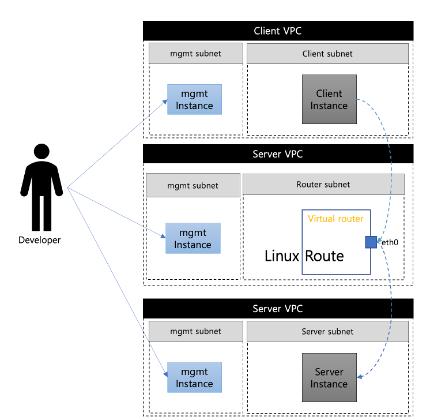

# VPP router 성능측정
### Khu 졸업 프로젝트

 

## 목적

 

Virtual Packet Processing(VPP)과 Data Plane Developement Kit (DPDK)를 이용한 가상화된 네트워크 기술의 성능 개선은 기존 리눅스 가상화된 네트워크 환경에서 발생하는 커널 호출과 멀티코어 문제, 우선순위 문제로 인한 성능 저하 문제를 해결하기 위해 VPP와 DPDK를 이용하여 가상화된 라우터와 방화벽의 성능을 개선하는 것을 목표로 한다.
논문에서는 VPP와 DPDK를 이용한 가상화된 라우터와 방화벽을 구축하고 성능 개선에 대한 실험을 진행할 것이다. 이를 위해 Trex 네트워크 트래픽 생성기를 이용하여 성능 측정을 한다.
결과로 VPP와 DPDK를 이용한 가상화된 네트워크 기술이 기존의 가상화된 네트워크 환경보다 더 나은 성능과 높은 처리량을 보장하는 가상화 네트워크를 구현한다.

 

## 라우터 구성
 

 *리눅스 가상라우터*

> 각각의 VPC에서 VM의 Linux 라우팅을 이용하여 라우팅을 하는 라우터를 구축한다. 각각의 subnet은 모든 트래픽을 Virtual router를 통해 주고 받는다.
이 라우터에서는 ip config의 netmask와 리눅스 기본 방화벽을 이용하여 라우터를 구축한다.

 *VPP DPDK 가상라우터*

 > Virtual router를 VPP와 DPDK를 이용하여 구성한다. DPDK를 이용하여 NIC를 유저스페이스 까지 올린 뒤, Virtual Packet processing을 하는 Virtual router instance를 만든다. 각각의 VPC는 외부 트래픽을 Virtual Router로만 보내고, Virtual router 내부에서 트래픽을 처리한다.

 

## 성능 측정
 

### 측정 환경

2core, 16gb instance

10000 ACL

### 성능 측정 결과
*리눅스 가상라우터*

| proto | 단위 | No ACL    | With ACL  |
|-------|------|-----------|-----------|
| TCP   | bps  | 660M       | 600M       |
|       | pps(Tx/Rx)  |  12K / 60K  | 55K / 55K |
|-------|------|-----------|-----------|
| UDP   | bps  | 660M      | 660M      |
|       | pps(Tx/Rx)  | 800K / 800K   | 800K / 800K |

*VPP DPDK 가상라우터*

| proto | 단위 | No ACL    | With ACL  |
|-------|------|-----------|-----------|
| TCP   | bps  | 11G       | 10G       |
|       | pps(Tx/Rx)  |  1.1M / 1M  | 1M / 1M |
|-------|------|-----------|-----------|
| UDP   | bps  | 9.9G      | 9.7G      |
|       | pps(Tx/Rx)  | 800K / 800K   | 800K / 800K |

## 소감

리서치를 하며 클라우드 환경이 발전해가며 다양한 네트워크 장비들의 가상화 방식이 많아지고 있다는 것을 느꼈고, 이러한 기술적 변화에 대응하기 위해 꾸준히 공부해야 겠다는 생각이 들었다.

회사 생활과 병행하며 프로젝트를 진행하는 것이 매우 빠듯했지만 보람있게 진행한 것 같다.